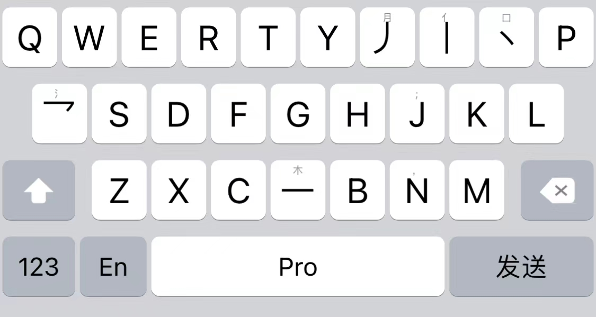
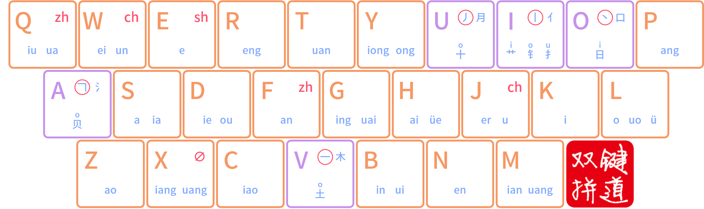
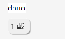
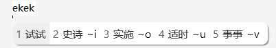
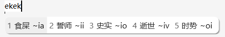
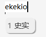
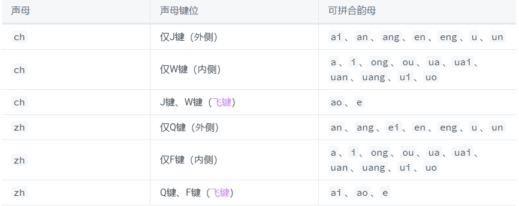
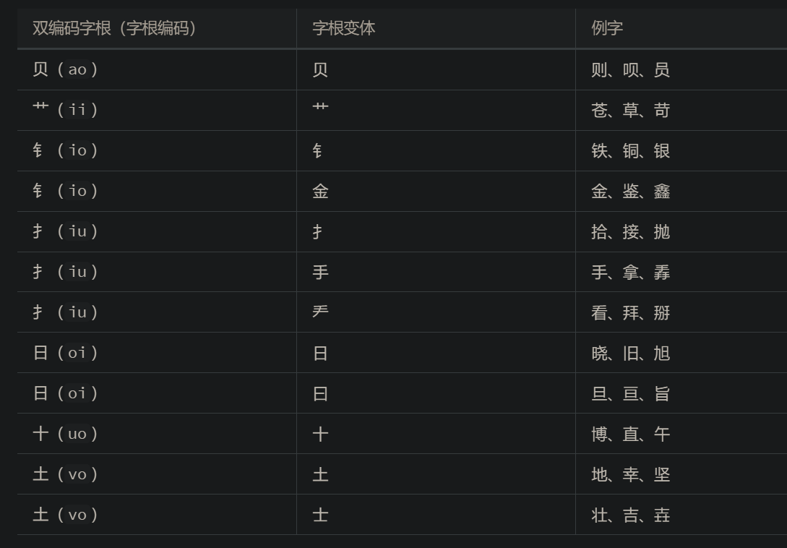
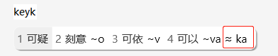
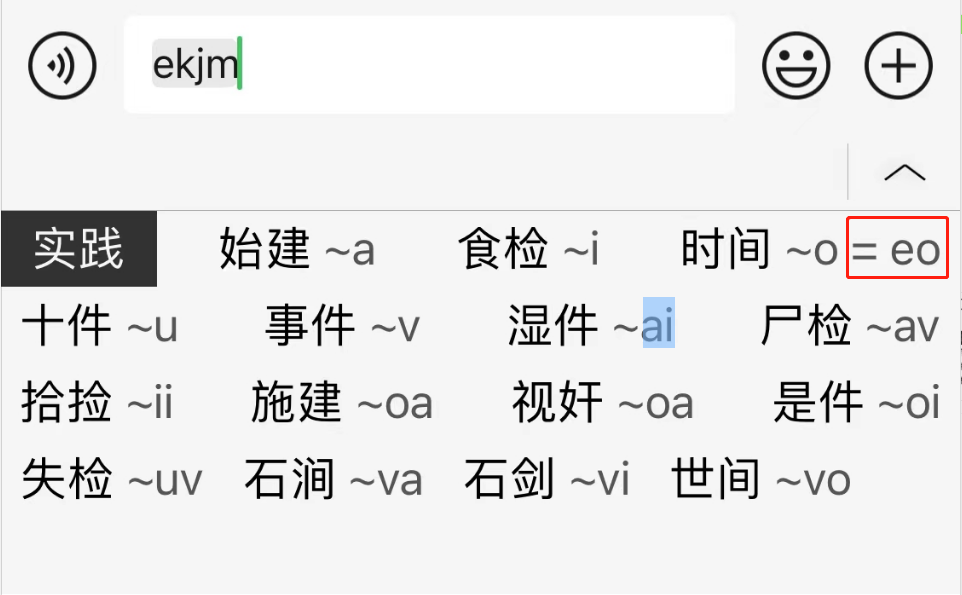

# 星空键道/键道6——简易入门教程

[TOC]

# 说明：本方案为星空键道6.2的功能拓展版，方案名为星猫键道

## 详细说明--->[点我查看](https://github.com/wzxmer/xkjd6-rime/tree/main/xmjd6#readme)

# IOS输入法app推荐：仓输入法  iRime  安卓推荐：同文

#### QQ交流群：[767053451](http://qm.qq.com/cgi-bin/qm/qr?_wv=1027&k=tHirlU3UbuU-q5CV5PjISeaTNV-eU52L&authKey=g9ePWYWWN7YmYMWk%2FrJ%2BJIgO0oDV0oPRfY3CHZxEzHjgzlzYlLrxFna6CFVCzYNH&noverify=0&group_code=767053451) 

#### TG群：[点我加入](https://t.me/+QrtkrWwmTdRkMWY9)

# 方案下载：[下载](https://github.com/wzxmer/xkjd6-rime/releases/)

### 注意！本教程方案为PC端移动端通用，rime两个皮肤(上方weasel.custom.yaml文件自行单独下载)黑白色

#### 推荐irime皮肤：

笔画版键盘，键道6专属

irime皮肤：[下载地址](https://github.com/wzxmer/irime-theme)

# 一、关于名称

> **全名：星空键道输入法6.0---简称：键道6**
>
> 官网：[星空输入法——键道6、一笔、两笔](https://xkinput.gitee.io/)
>
> 详细教程：[星空键道](https://pingshunhuangalex.gitbook.io/rime-xkjd/)
>

# 二、了解键道

> 
>
> 键位图如上，一图让你学会键道6。

#  												双拼为主，形为辅。

## 1. 双拼为主

​		什么是双拼就不解释了，键道6的双拼键位图如上，这里主要提下键道6在双拼键位上的不同点。

###  1.1  关于韵母：uang

​		X跟M键的uang是一样的，用哪一个都可以，没区别，这样发明的目的是为了左右手的协调性，也称为：左右互击。不至于只用某一只手，就只是为了避免左右手不协调，出现单手打字的情况。

###  1.2  飞键新手篇

​		这个让很多人望而却步的功能，先说下基本作用：**Q跟F都代表ZH，J跟W都代表CH**

> 飞键的设计目的是为了打字不别手，刚开始学键道6，那就只看完这段就够了，需要ZH的时候，Q摁出来不对就换F，J跟W也是，先熟悉整体键位了，能基本依靠双拼+笔画提示(辅助码)打字了，想提高效率了，再回头来看看到底什么时候ZH用Q还是F，CH用J还是W。

> 飞键详解请看深入键道篇——〉

## 2. 形为辅

​		再放一次键位图

键道6的形，用的是**笔画**以及**少数字根**，图中**紫色边框**即是，笔画键跟字根键统称形键，分两部分：

**笔画：**

U键：丿    撇

I键： 丨    竖

O键：丶    点           特别说明：㇏  一捺 同等丶 ，捺有关的笔画也都是O键

A键：乛    横折        特别说明：㇆  横竖也都包括了

V键：一    横

**字根**：

U     月

I      亻      包括：人

O     丶

A      氵      包括：水、氺

V     木       包括：朩

形键里面，只有一个特别要注意的地方，图中，形键中下方的字根，属于双码字根（双码字根头上都有说明对应的另外一个键是什么），也就是，两个键才能组成的，比如U键里面下方的“十”，表示：u+o=十。我们打个字举例，比如“戴”，先打双拼：dh，再用笔画筛选，十字开头，所以是uo，如下图：

其余字根也是如此，艹 = ii ， 钅= io，这样解释，相信大家就都能看明白形键中的双码字根了。

> 好了，看到这你就已经可以开始使用键道6进行基本打字了

# 三、深入键道

## 1. 拆字规则
> 声笔拆字法，声指：声母，笔指：笔画。

###  1.1  单字

​		键道的码长最多为6码，而拆字规则称之为“二分法”，名如其意，把一个字分为两部分。用例子来说，注：以下使用例子为全码，实际使用过程中，几乎很难用到全码。

例如：

​	胖   ppuouv

> 我们来拆解下这个全码
>
> PP为胖的音  ——>  p+ang
>
> 接着，我们使用二分法将字分为两部分，月 + 半，U本身代表了一个字根：月
>
> 所以PP后，为U  ——>  ppu
>
> 这时候胖，我们已经拆了一半了，接着，我们写半，半的第一笔是丶，
>
> 所以，是O   ——>  ppuo
>
> 再写半的第二笔丿，对，你没看错，不是点，是撇，所以是U
>
> 所以，加撇  ——>  ppuou
>
> 最后我们写一（横）为V，这时就已经6码了，胖的全码就拆解完毕了

###  1.2  词组

####  二字词  

> 采用（声 + 韵 +声 + 韵 ）+（+ 第一个字首笔画 + 第二个字首笔画）

举例：          

​		ekek=shishi，首选默认试试。     图中~后面的为形码（辅助码）提示

假如我们要打史实（翻页查看）

按照上面的规则，史实的第一个字首笔是竖，是i，再加上第二个字的首笔是点，是o，所以是io

以此类推。

除开2字词，还有大家知道的三字简词，四字成词。

####  三字词

> 采用（声 + 声 + 声 + 第一个字的首笔画 + 第二个字的首笔画 + 第三个字的首笔画）

举例：

​		咬咬牙，音是yyy，然后顺着第一个字咬的笔画，口，口字因为是字根，在O，所以yyyo，第二个字还是咬也是口开头，所以还是O，就yyyoo了，然后第三个字牙第一笔是一横，所以是yyyoov

####  多字词组

> 采用（声 + 声 + 声 + 末字的声 ）+ 首字首笔画 + 第二字首笔画

举例：

## 2. 飞键

> ZH有两个，Q键称为外侧，F键为内侧。CH同理

表中的意思是说，我们以音韵的形式打字，韵母 ai 、ao 、e 的情况，Q还是F，都可以，只有前面两行的韵母需要区分。

不需要死记硬背，简化记忆流程：

> 以韵母字母个数来说，单个为短，多个为长。

Q键快速记忆，a长e长是Q，u、un是Q。

> 只记Q键，其余要用ZH就是F，ch也同理。

举例：

​		四字成语，茁壮成长，zhuo zhuang cheng zhang ，音码 ffjq 

​		拆解：韵母a开头的只有ang、eng，a长为Q，其余f，e长为 j，其余为W。

# 四、双码字根补充

​		想看详细字根表请看详细教程——>[点我](https://pingshunhuangalex.gitbook.io/rime-xkjd/learn-xkjd/stroke-rules)

# 五、扩展功能630

> 630是在原生方案的基础上，某位不知名大佬加进来的扩展功能，与原词库无任何冲突的630个简词。

一开始使用键道完全不用管，熟悉键道后可以注意一下，当出现以下情况，说明，你打的词是有630简码的

可以的630简码为ka，时间为eo，规则如下：

​																		声笔/声笔笔（sb/sbb)

​													取首字声 + 取第二个字的首笔/+取第三个字的首笔
