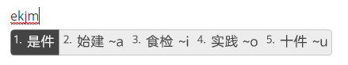
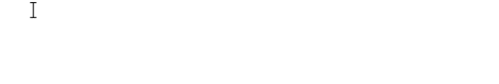

# 二字词



简称：**打词**。

**核心思想：以双拼编码为基础，如果没有出你要打的词，就用笔画继续拆解。**



## 1.双拼为主

**键道6作为一个主打词的输入法方案，码长最长为6码，我们日常使用的常用词直接以双拼编码（4码）就能打出来**，例如：

## 2.形为辅

如果首选不是你要的词，那么再加以笔画拆解即可。



规则：

双拼编码+第一个字第一笔

或者

双拼编码+第一个字第一笔+第二个字第一笔



例如：

我要打一个词 ” 事件 “

先打这个词的音 ” ekjm “

出来的是双拼首选 ” 是件 “

不是我们要的 ” 事件 “ ，按照我们的规则，加第一个字的笔画，” 事 “ 的第一笔是横，也就是V键，那么

就出来我们要的 ” 事件 “ 。

截图中所显示的是，这个音后面可以加的笔画，能打出什么词。

而 ” ekjm（shijian）“ 这个音，第一笔是横的词有很多，例如上图显示结果。

再比如我们要打 " 世间 "，因为第一个字 ” 世 “ 的第一笔也是横，而 " ekjmv " 是 ” 事件 "，那么再加上第二个字 ” 间 “ 的第一笔 ” 丶“，也就是o，编码为 “ ekjmvo ”， 就可以打出 " 世间 "。

怎样，是不是很简单？
