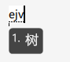
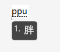
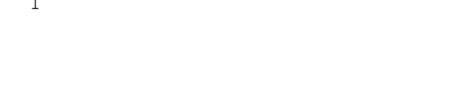

# 单字



**此篇主要是了解字根，以及基础的拆字，学完这里，快入入门进度完成了80%**



## 字根

键道的5个笔画键除了是：**横、竖、撇、捺、点**

它们还有充当字根，再次回顾一下键位分布。

**紫色按键的红圈，圈出来的是笔画。**

这5个键除了是笔画键外，还是**字根（偏旁部首）**，即：



**单字根：**即**单个按键**直接作为一个完整的偏旁部首。**双码字根：**需要**两个按键**才能组成一个偏旁部首。



| 按键 |  单字根  |          双码字根           |
| :--: | :------: | :-------------------------: |
|  A   |    氵    |          贝（A+O）          |
|  V   |    木    |          土（V+O）          |
|  U   |    月    |          十（U+O）          |
|  I   | 亻（人） | 艹（i+i）钅（i+O）扌（i+U） |
|  O   |    口    |          日（O+i）          |

## 单字根

示例字及详细拆解，例如打 “ 游 ” 字

**音码部分=声母+韵母**，要打**you**音按键为**y+d**，接下来我们按照**笔画拆解**，**游**字是 “ **氵**”字根开头，它在**A键**上，直接作为**第一笔**，现在就是**yda**，而**又**字比**游**字常用，而且**a**也代表了**横折**，所以可以看到出来的是**又**而不是**游**，不是我们要打的字，那我们只要继续按照规则拆解即可，加**游**字的**第二笔 “ 丶 ”，**是**O键**，这时加上**O键**出来了**游**字，所以**游**字编码为：**ydao**

上面是**A键**上的**氵**字根示例，再看下其它四个的例子。

**树**字拆解，音：shu=ej，**木**字旁，在**V**键，加V，**即：ejv**

**胖**字拆解，音：pang=pp，**月**字旁，在**U**键，加U，**即：ppu**

**伴**字拆解，音：ban=bf，**亻**字旁，在 **i** 键，加 i ，即：bfi，不是所要的字，再加第二笔**丶**，是在**O**键，**即：bfio**

**怂**字拆解，音：song=sy，**人**字头，在 **i** 键，加 i ，即：syi，不是所要的字，再加第二笔，还是人字，**即：syii**

**叩**字拆解，音：kou=kd，**口**字旁，在**O**键，加O，**即：kdo**



**这就是笔画+5个单字根拆解。上面可以看到，如果加了第一笔笔画（或者字根）后，没得到我们想要的字，继续拆解即可。**



## 双码字根

由两个按键组成一个字根。示例：

**赔**字拆解，音：pei=pw，**贝**字旁，而贝字是双码字根，是A键+o键，**即：pwao**。

再看一下其余示例

**字根：土，十，艹，钅，扌，日**

**示例字：培、博、艺、键、撤、扒、旱**

这就是双码字根的使用了。

**注意：演示中可以看到，实际打字过程中，你并不一定需要把完整的双码字根打出来，但是你一定得知道怎么拆解**。

## 打单必备的秘诀：两分拆字法

#### 何谓两分？



即，把一个字拆成两部分，无论是从上下拆，还是左右拆。

一句话总结拆字规则：**能拆就两分，不能就顺笔。**



**1.单字能两分**

**无论是拆分上下或左右：声+韵+首笔+次笔+另一半的首笔+次笔**

解：

​	一个字无论是能从上下或者左右，只要能分为两部分的，就用两分法，将这个字拆分为两部分。规则为 **“ 声母（声）+韵母（韵）+第一部分的第一笔（首笔）+第一部分的第二笔（次笔）+ 第二部分的第一笔+第二部分的第二笔**

讲示例前，先说明一个定义，**键道中，严格来说，一个字的编码，没有用到全码，6码的，都属于是简码，只有6码才属于全码（键道中的每个单字都有一个全码）**，以下示例采用全码讲解：

” 就 “ 字：

​	可左右分，分为：京、尤。

​	按照规则拆解，就字的音码为：jiu = j + q  （ 声母 + 韵母 ） 

​	京 字的第一笔和第二笔是：丶+ 一（ 点 + 横 ）

​	所以第一部分取：o + v	

​	尤 字的第一笔和第二笔是：一 + 丿（ 横 + 撇 ）

​	所以第二部分取：v + u	

” 就 “ 字全码为：

**2.单字无法两分**

**不能两分就顺笔：音+韵+首笔+次笔+三笔+四笔**

解：

​	无法使用两分拆字，直接按照笔画顺序拆解即可，键道中全码为6码，音码占2码，所以按照笔画顺序，最多也是四笔。

​	示例以全码讲解：

” 用 “ 字：

​	按照笔顺即可（四笔）：丿+ 𠃌 + 一 + 一 

​	换成按键： u + a + v + v

即：

​	

**以上演示示例都为全码，实际使用过程中并不需要全码即可打出，采用全码只是为了大家更加的理解规则。**
