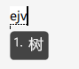
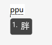
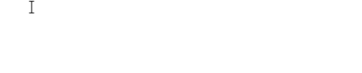

# 单字



**此篇主要讲解的是键道6的拆字规则，一共有3大部分，1是字根，2是单字能两分是怎么拆解的，3是不能两分是如何拆解的。此篇结束，快速入门学习进度达到80%**



## 字根

键道的5个笔画键除了是：横、竖、撇、捺、点

它们还有充当字根，再次回顾一下键位分布。

紫色按键的红圈，圈出来的是笔画。

这5个键除了是笔画键外，还是字根（偏旁部首），即：



**单字根：**即**单个按键**直接作为一个完整的偏旁部首。**双码字根：**需要**两个按键**才能组成一个偏旁部首。



| 按键 |  单字根  |          双码字根           |
| :--: | :------: | :-------------------------: |
|  A   |    氵    |          贝（A+O）          |
|  V   |    木    |          土（V+O）          |
|  U   |    月    |          十（U+O）          |
|  I   | 亻（人） | 艹（i+i）钅（i+O）扌（i+U） |
|  O   |    口    |          日（O+i）          |

### 单字根

示例字及详细拆解

**音码部分=声母+韵母，要打you音为y+d，**接下来我们按照笔画顺序拆解，**游**字是 “ **氵**”字根开头，它在**A键**上，直接作为**第一笔**，现在就是**yda**，可以看到出来的是**又**不是**游**，不是我们要打的字，只要继续按照规则拆解，加**第二笔 “ 丶 ”**，**O键是点**，这时加上O键出来了**游**字，所以**游字编码为：ydao**

上面是**A键**上的**氵**字根示例，再看下其它四个的例子。

树字拆解，音：shu=ej，木字旁，在V键，加V，即：ejv

胖字拆解，音：pang=pp，月字旁，在U键，加U，即：ppu

伴字拆解，音：ban=bf，亻字旁，在 i 键，加 i ，即：bfi，不是所要的字，再加第二笔丶，在o，即：bfio

怂字拆解，音：song=sy，人字头，在 i 键，加 i ，即：syi，不是所要的字，再加第二笔，还是人字，即：syii

叩字拆解，音：kou=kd，口字旁，在o键，加o，即：kdo

**这就是笔画+5个单字根拆解。上面可以看到，如果加了第一笔笔画（或者字根）后，没得到我们想要的字，继续拆解即可**

### 双码字根

由两个按键组成一个字根。示例：

赔字拆解，音：pei=pw，贝字旁，而贝字是双码字根，是A键+o键，即pwao。

再看一下其余示例

字根：土，十，艹，钅，扌，日

示例字：培、博、艺、键、撤、扒、旱

这就是双字根的使用。

演示中，例如撤字，并不需要把 i 键+u键才能组成的 扌打出来，这是因为在键道6中，我们只有打全码时，才需要把完整的编码拆解出来，其余时候，只要使用简码。

注：星空键道6中90%以上的字都有一个简码和全码，只有极少部分是只有全码。

## 全码

演示：

## 何谓两分？



即，把一个字拆成两部分，无论是从上下拆，还是左右拆。

ydao

一句话总结：**能拆就两分，不能就顺笔。**

## 两分：

**1.<单字能两分，拆分上下或左右>声+韵+首笔+次笔+最后一个部件的首笔+次笔**

**2.<单字无法两分>音+韵+首笔+次笔+三笔+四笔顺笔规则**

#### 

