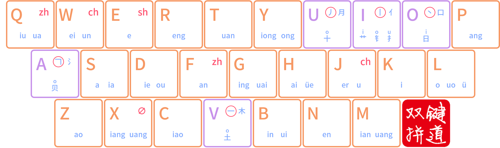
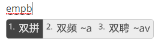
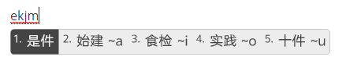
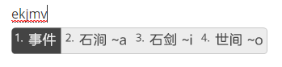

# 二字词



也就是平常称作的**打词**。

**核心思想：以双拼编码为基础，如果没有出你要打的词，就用笔画继续拆解。**



## 1.双拼为主

键道6二字词码长最长为6码，常用词4码，直接以双拼编码就能打出来，例如：

## 2.形为辅

如果首选不是你要的词，那么再加以笔画拆解



规则：

双拼编码+第一个字第一笔

或者

双拼编码+第一个字第一笔+第二个字第一笔



例如：

我要打：事件

先打这个词的音：ekjm

出来的是双拼首选：是件

不是我们要的 ” 事件 “ ，按照我们的规则，加第一个字的笔画，” 事 “ 的第一笔是横，也就是V键，那么

就出来我们要的 ” 事件 “ 。截图中所显示的是，这个音后面可以加的笔画，能打出什么词。

而ekjm（ShiJian）这个音，第一笔是横的有很多，例如上图显示结果，比如我们要打世间，就可以在ekjmv基础上再加上O，也就是ekjmvo 就可以打出世间
