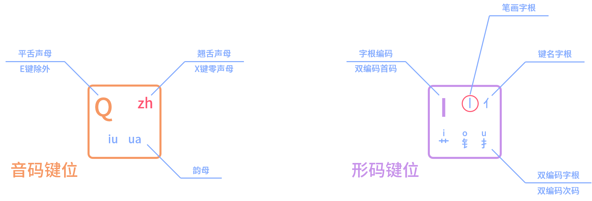

## 键位分布



双拼输入法介绍：将全拼拆分为**声母**和**韵母**两部分

------

**声母**——>图中**橘色、红色**字母。

**韵母**——>图中**蓝色小写**字母。

|  示例  | 声母 | 韵母 |
| :----: | :--: | :--: |
|  hao   |  h   |  ao  |
| shuang |  sh  | uang |



# 笔画键位

上图以可以看到，星空键道以21个键的双拼布局为基础，采用了5个键对应5个笔画，分别是：

| **A** | **乛（横折、横竖等）** |
| :---: | :--------------------: |
| **V** |      **一（横）**      |
| **U** |      **丿（撇）**      |
| **I** |      **丨（竖）**      |
| **O** |    **丶（点、捺）**    |



星空键道6的主要组成就是以上部分：**双拼+5个笔画键**。

如果你有输入法方案基础了解，可以仔细看看下图，如果觉得下图看不懂，大致看看即可，不懂也没关系，可以学完后再看



## 键位拆解

